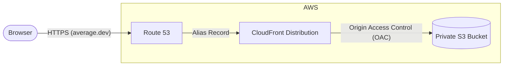

# Web Application Infrastructure (`average-dev-web`)

This module provisions an enterprise-grade, highly secure static website hosting architecture on AWS. It is designed specifically to host Single Page Applications (SPAs) like React or Vue built with Vite.

## Architecture Diagram

## How It Works (Best Practices)

### 1. Private S3 Bucket (Zero Public Access)
Unlike traditional static sites that open the S3 bucket to the public internet, this bucket has **Block Public Access** fully enabled. 
- No one can read files directly from the bucket URL.
- The `aws_s3_bucket_policy` strictly mandates that requests **must** originate from our specific CloudFront distribution using an `AWS:SourceArn` condition.

### 2. CloudFront Origin Access Control (OAC)
To access the private S3 bucket, CloudFront uses **OAC** (the modern, secure replacement for OAI). OAC cryptographically signs all requests that CloudFront makes to S3, ensuring that even if a malicious user guesses the S3 bucket name, they cannot access it unless they route through the CDN.

### 3. SPA Routing (React Router)
When a user navigates to a sub-route in a React app (e.g., `average.dev/dashboard`), that file path doesn't actually exist in the S3 bucket; everything is handled client-side by Javascript.
- To prevent AWS from throwing a `404 Not Found` error, we configured **CloudFront Custom Error Responses**.
- If S3 returns a 403/404, CloudFront catches it, changes the HTTP status code to `200 OK`, and serves `/index.html` instead. This passes the URL to React Router to handle internally.

### 4. Folder-Based Asset Versioning
This module is paired with a specific CI/CD deployment strategy for zero-downtime updates:
- **Vite Base Paths**: During the GitHub Actions build, Vite injects the Git Commit SHA into all asset paths (e.g., `/b8e0c5c/assets/index.js`).
- **S3 Time Capsules**: The CI/CD pipeline pushes the assets directly into a folder named after that SHA in the S3 bucket, and applies a 1-year `immutable` cache header. Old folders are never deleted.
- **Root Router**: The `index.html` file is placed at the absolute root of the bucket with a `must-revalidate` cache header. It acts as the pointer to the latest SHA folder.

Because old versions of the app remain indefinitely in their SHA folders, users who leave the website open for days will never experience a "Chunk Load Error" when clicking a button that lazy-loads an old asset, even if a new version of the site was deployed an hour ago.
